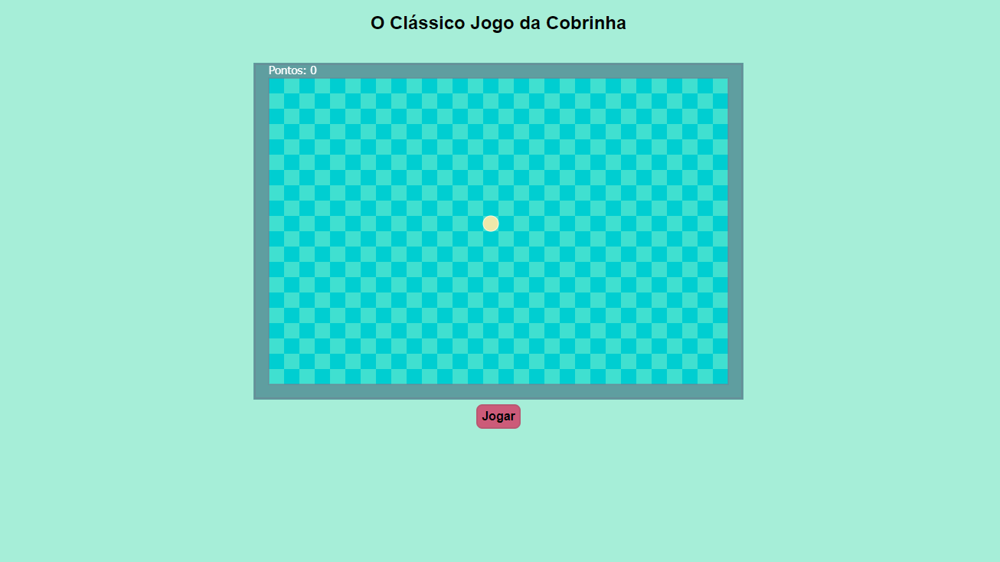
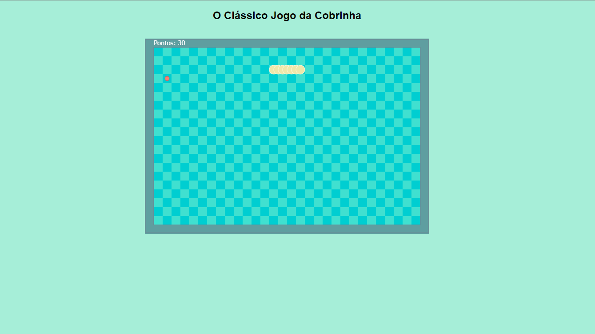
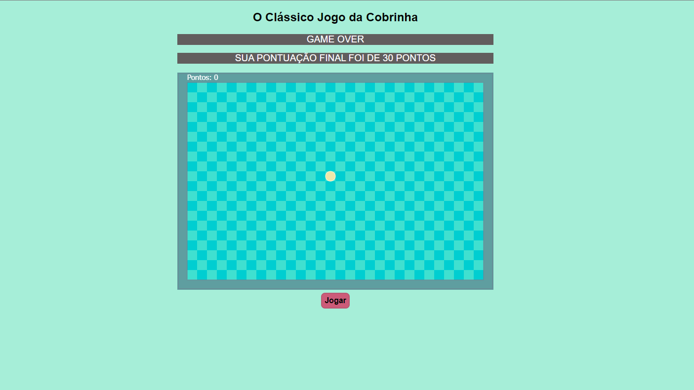

# Jogo da Cobrinha

Projeto feito como conclusão de curso da plataforma Alura, praticando os conhecimentos adquiridos na programação com JavaScript. O código é simples, utilizando a linguagem pura e o básico de HTML e CSS.

## Galeria

Muito obrigada :)